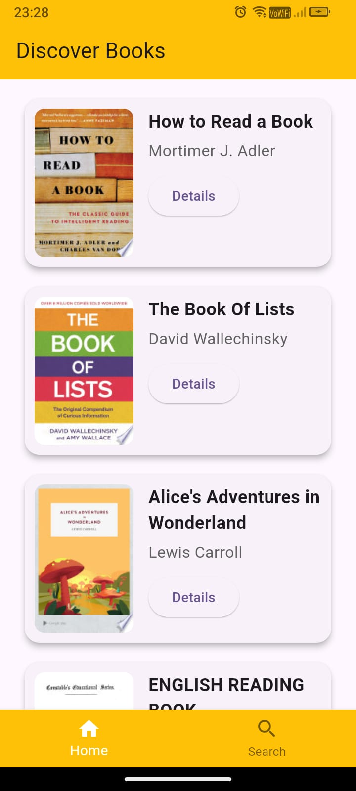
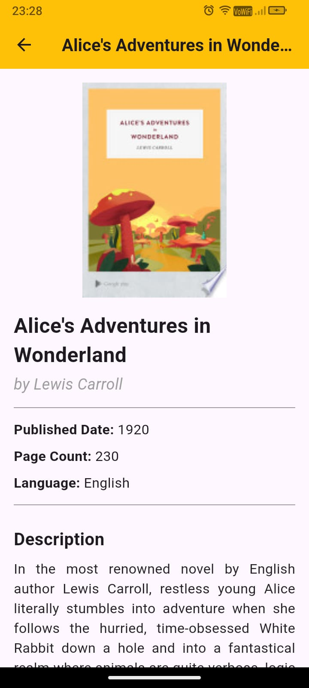

# BookishME App

BookishME is a Flutter-based application designed for book enthusiasts. It enables users to search for books, view detailed book information, and seamlessly navigate between pages. The app utilizes the BLoC (Business Logic Component) architecture to ensure a clean, scalable, and maintainable codebase. Additionally, the pagination feature allows users to discover new books effortlessly, loading more content as they scroll, providing a smooth and continuous browsing experience.

---

## Features

- **Discover Books**: This feature allows users to explore a wide variety of books fetched randomly from Google APIs.
- **Search Books**: Real-time search functionality to fetch books as users type in the search bar.
- **Book Details**: View detailed information about a book, including title, author, and description.
- **Navigation**: Bottom navigation bar for seamless navigation between the Home and Search pages.
- **Responsive UI**: Optimized for an aesthetically pleasing user experience.

---

## Technology Stack

- **Flutter**: Frontend framework for building cross-platform applications.
- **BLoC**: State management solution for predictable and testable state transitions.
- **Dio**: HTTP client for API integration.
- **Material Design**: Provides a consistent UI/UX across the app.

---

## Architecture

The app follows the **BLoC Architecture**, ensuring separation of concerns and a clean code structure:

- **Presentation Layer**: Contains widgets and UI components (e.g., HomePage, SearchPage, BookDetailsPage).
- **Business Logic Layer**: Managed by BLoC classes that handle events and emit states.
- **Data Layer**: Contains models and services to fetch and process data.

---

## Prerequisites

- **Flutter**: Version 3.x or later.
- **Dart**: Version 2.19 or later.
- **Android/iOS Emulator or Device**: For testing.

---

## Installation Instructions

1. Clone the repository:
   ```bash
   git clone https://github.com/username/bookishme.git
   cd BookishMe
   ```

2. Install dependencies:
   ```bash
   flutter pub get
   ```

3. Run the app on an emulator or connected device:
   ```bash
   flutter run
   ```

---

## File Structure

```
lib/
├── data/
│   ├── models/            # Data models (e.g., BookModel)
│   └── services/          # API integration services
├── presentation/
│   ├── bloc/              # BLoC files for state management
│   ├── components/        # Reusable UI components (e.g., BookCard, buildBottomNavigationBar)
│   ├── pages/             # Page widgets (e.g., HomePage, SearchPage)
└── main.dart              # App entry point
└── routes.dart            # App routes and navigation management
```

---

## Key Files and Functionalities

- **`main.dart`**: Entry point of the application. Sets up navigation and dependencies.
- **`BookBloc`**: Manages events and states related to books (e.g., `FetchBooks`, `BookLoaded`).
- **`BookModel`**: Represents the structure of a book fetched from the API.
- **`BookCard`**: UI component to display individual book details.
- **`SearchPage`**: Implements the real-time search functionality.
- **`ApiServices`**: Responsible for the API calls (uses google APIs)

---

## Usage Instructions

1. Launch the app on your device or emulator.
2. Use the **Bottom Navigation Bar** to switch between the Home and Search pages.
3. In the Search page:
   - Type in the search bar to find books dynamically.
   - Click on the details button on a book to view detailed information.

---

## Screenshots

### Home Page


### Search Page


### Book Details Page
